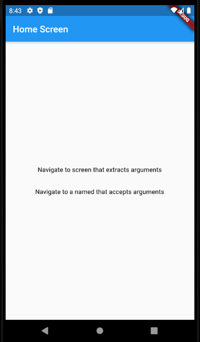

# lab4 Navigation for flutter

Thực hành điều hướng và định tuyết

## Getting Started

This project is a starting point for a Flutter application.

```dart
import 'package:flutter/material.dart';
import 'animate.dart';
import 'navigator-name.dart';

void main() {
  runApp(MaterialApp(
    title: "Test",
    initialRoute: '/',
    routes: {
      // When navigating to the "/" route, build the FirstScreen widget.
      '/': (context) => MyApp(),
      // When navigating to the "/second" route, build the SecondScreen widget.
      '/second': (context) => SecondRoute(),
    },
  ));
}

class MyApp extends StatelessWidget {
  @override
  Widget build(BuildContext context) {
    return MaterialApp(
      title: 'Flutter Demo',
      theme: ThemeData(
        primarySwatch: Colors.blue,
        visualDensity: VisualDensity.adaptivePlatformDensity,
      ),
      home: MyHomePage(title: 'Bai Tap B4.1 Navigator'),
    );
  }
}

class MyHomePage extends StatefulWidget {
  MyHomePage({Key key, this.title}) : super(key: key);

  final String title;

  @override
  _MyHomePageState createState() => _MyHomePageState();
}

class _MyHomePageState extends State<MyHomePage> {
  int _counter = 0;
  Color _color = Colors.red;
  // Color listColor = [Colors.blue, Colors.blue];
  void _incrementCounter() {
    setState(() {
      _counter++;
    });
  }

  @override
  Widget build(BuildContext context) {
    return Scaffold(
      appBar: AppBar(
        title: Row(
          children: [Icon(Icons.home), Text(widget.title)],
        ),
      ),
      body: Center(
          child: GestureDetector(
        onTap: () => {
          Navigator.push(
              context, MaterialPageRoute(builder: (context) => SecondRoute()))
        },
        child: Column(
          mainAxisAlignment: MainAxisAlignment.center,
          children: <Widget>[
            IconButton(
                icon: Icon(Icons.favorite),
                onPressed: () {
                  setState(() {
                    _counter++;
                  });
                }),
            Text('$_counter'),
            FlatButton(
              onPressed: () => {
                Navigator.push(context,
                    MaterialPageRoute(builder: (context) => SecondRoute()))
              },
              color: Colors.blue,
              child: Text("Navigator"),
            ),
            FlatButton(
              onPressed: () => {
                Navigator.push(context,
                    MaterialPageRoute(builder: (context) => MainScreen()))
              },
              color: Colors.blue,
              child: Text("Animate"),
            ),
            FlatButton(
              onPressed: () => {
                Navigator.pushNamed(context, '/second')
              },
              color: Colors.blue,
              child: Text("Navigator name"),
            ),
            FlatButton(
              onPressed: () => {
                Navigator.pushNamed(context, '/second')
              },
              color: Colors.blue,
              child: Text("argument"),
            ),
          ],
        ),
      )),
    );
  }
}

class SecondRoute extends StatelessWidget {
  @override
  Widget build(BuildContext context) {
    return Scaffold(
      appBar: AppBar(
        title: Text("Second Route"),
      ),
      body: Center(
          child: FlatButton(
        color: Colors.green,
        child: Text("Back Home"),
        onPressed: () => {Navigator.pop(context)},
      )),
    );
  }
}

```

### Kết quả
Trang chủ định tuyến




